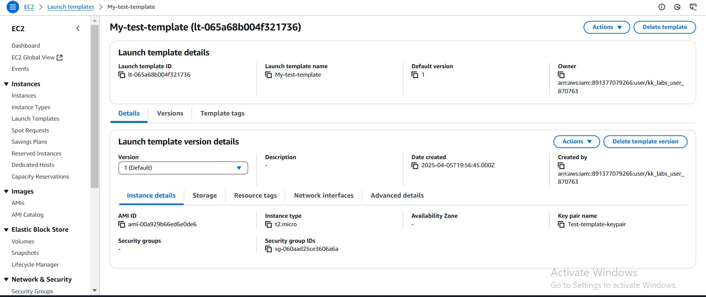

# Aws-compute-services Assignment

**1. Launch an EC2 instance and configure it with a custom security group.**

**Step 1**

1. Go to your AWS Management Console,

On the EC2 Dashboard, scroll down and look for Network & Security > Security Groups.

Click Create Security Group.

Fill in the details:

Security group name: (e.g., my-custom-sg)

Description: (e.g., Security group for my EC2 instance)

VPC: Choose the default VPC unless you have a custom one.

2. Add Inbound Rules (what traffic is allowed in)

Click Add Rule.

Type: SSH

Protocol: TCP

Port Range: 22

Source: My IP (for security) or Anywhere (0.0.0.0/0) if testing.

You can also add:

HTTP on Port 80 (for web server)

HTTPS on Port 443 (for secure sites)

Outbound Rules: Leave as default (All traffic allowed).

Click Create security group.

**Step 2**

To launch an EC2 Instance:

Go back to the EC2 Dashboard.

Click Instances > Launch Instance.

Fill in the Launch Settings:

Name and Tags: Give your instance a name (e.g., MyTestServer).

Application and OS Image (AMI): Select Amazon Linux 2 

Instance Type: Choose t2.micro (free tier eligible).

Key Pair (login):

Choose an existing key pair if you have one.

Or create a new key pair and download the .pem file. which is very important for SSH into your EC2 instance.

Edit Network Settings:

Under Firewall (security groups):

Choose Select existing security group.

Then select your custom security group (my-custom-sg) you just created.

Review the settings.

Click Launch Instance.

**Step 3**

Connect to Your EC2 Instance you created.

Once the instance is running:

Select your instance > Click Connect at the top.

Choose SSH Client Using this following commands;

1. chmod 400 your-key.pem (i.e your Key pair you created). This command makes sure your key file has correct permissions.

2. ssh -i /path/to/your-key.pem ec2-user@your-ec2-public-ip. (Replace /path/to/your-key.pem with where you saved your key, and replace your-ec2-public-ip).

**2 Install a web server Apache on the instance**

 These are following steps taken to install Apache Web server on Amazone Linux
 
 1. SSH into your EC2 instance.
    On your terminal, using this command ssh -i /path/to/your-key.pem ec2-user@your-ec2-public-ip. (Replace /path/to/your-key.pem with where you saved your key, and replace 
    your-ec2-public-ip)

 2. Update the Server Packages.
    Using this command sudo yum update -y

    

3. Install the Web Server.
   Install Apache (httpd)
   Using this command sudo yum install httpd -y

   

4. Start and Enable the Web Server
   After installing, you need to start the web server and enable it to auto-start when the server reboots.
   Using this following commands;
   sudo systemctl start httpd
   sudo systemctl enable httpd

5. Test the Web Server
   Open your browser and visit: http://your-ec2-public-ip (your EC2 public IP address)

   

**3. Create an Auto Scaling Group with a Load Balancer.**

**Step 1**

1. Login to AWS Console
   Open AWS Console and sign in.

2. Create a Launch Template
   Auto Scaling needs a Launch Template (it defines the EC2 settings).

Go to EC2 Dashboard > Launch Templates > Create launch template.

Fill the template:

Name: (e.g., my-launch-template)

Template version description.

AMI ID: Choose an AMI (e.g., Amazon Linux 2).

Instance Type: (e.g., t2.micro)

Key Pair: Select your existing key pair.

Network settings: Leave default or select security group.

Storage: Default is fine.

Click Create launch template.

**Step 2**

Create a Target Group.

You need a Target Group for your Load Balancer to know where to send traffic.

Go to EC2 Dashboard > Target Groups > Create Target Group.

Fill the target group:

Choose Target Type: Instance.

Protocol: HTTP.

Port: 80.

VPC: Choose your default VPC.

Health checks:

Protocol: HTTP.

Path: / (default).

Click Create target group.

**Step 3**

Create a Load Balancer

Go to EC2 Dashboard > Load Balancers > Create Load Balancer.

Choose Application Load Balancer (ALB).

Fill the details:

Name: (e.g., my-load-balancer).

Scheme: Internet-facing.

IP address type: IPv4.

Network mapping: Select at least two subnets (across different Availability Zones).

Security group: Select or create a group that allows HTTP (port 80).

Listeners: HTTP, port 80.

Register Targets:

Choose your Target Group created in Step 3.

Click Create Load Balancer.

**Step 4**

Create an Auto Scaling Group (ASG)

Finally, create the Auto Scaling Group to automatically manage instances.

Go to EC2 Dashboard > Auto Scaling Groups > Create Auto Scaling group.

Fill the details:

Name: (e.g., my-auto-scaling-group).

Launch Template: Choose the launch template you created in Step 2.

Network:

Select your VPC and at least two Availability Zones.

Attach to Load Balancer:

Select Attach to an existing load balancer.

Choose Application Load Balancer.

Choose the Target Group you created earlier.

Set Group Size:

Desired Capacity: 2 (for example)

Minimum Capacity: 1

Maximum Capacity: 3

Configure Scaling Policies (optional):

Use Target Tracking Scaling Policy if you want AWS to automatically add/remove instances based on CPU usage.

Add Tags (optional):

Click Create Auto Scaling group.

**To Ensure Load Balancer Test Results**

Visit the Load Balancer DNS

Each Load Balancer has a DNS name. To test it:

Go to Load Balancers.

Copy the DNS name (e.g., my-load-balancer-1234567890.us-east-1.elb.amazonaws.com

Open your browser and paste your DNS name. You should see a web server page. (If it doesn't, it means your EC2 instances aren’t responding correctly maybe missing web server or wrong security group).

